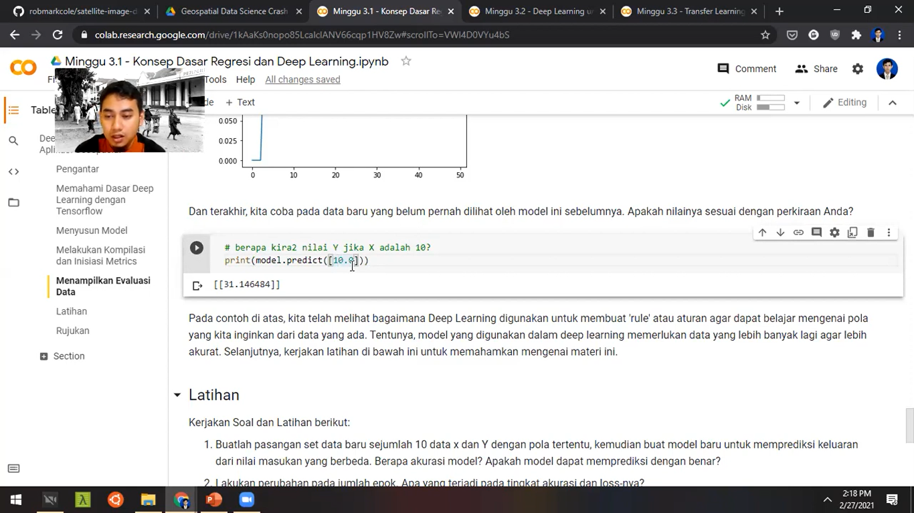

# Geospatial Data Science Crash Course

## Tentang Pelatihan Ini

Repository ini menyimpan materi pelatihan Geospatial Data Science Crash Course yang diselenggarakan secara daring untuk [Departemen Teknik Geodesi UGM](http://geodesi.ugm.ac.id/) pada Bulan Februari 2021. Halaman ini memuat file IPYNB yang dibuat sebagai panduan pada saat sesi praktek. Slide materi dan rekaman video juga dapat diakses melalu repository ini.

## Alat dan Bahan

Pelatihan ini sepenuhnya menggunakan perangkat berbasis komputasi awan (i.e. Google Colab) dengan Python sebagai bahasa pengantar utamanya. Modul-modul Python terkait dengan Analisis Geospasial, Data Mining, Machine Learning dan Deep Learning digunakan pada sesi praktek. Sumber data yang digunakan berasal dari data bebas dan terbuka, seperti OSM (melalui OSMNX) dan citra satelit dari sumber terbuka. Set data Landuse Classification dari UC Merced digunakan dalam praktek pembangunan model deep learning untuk identifikasi objek melalui citra.

## Konten

Berikut adalah konten materi dari Pelatihan Geospatial Data Science untuk mahasiswa Departemen Teknik Geodesi UGM. Pelatihan ini terdiri dari tiga sesi, dengan tiap sesinya dibagi menjadi teori dan praktek dengan durasi kurang-lebih dua jam tiap sesinya. 

Pembagian materi ini adalah sebagai berikut. Klik pada link yang tersedia untuk mengakses sumber:

**Minggu 1: Geospatial Data Science** [(Slide)](https://github.com/danylaksono/gds-crashcourse/blob/main/Slides/Hari%201.%20Pengantar%20Geospatial%20Data%20Science.pptx) [(Panduan Latihan)](https://colab.research.google.com/github/danylaksono/gds-crashcourse/blob/main/Minggu%201%20-%20Pengantar%20Geospatial%20Data%20Science.ipynb)
- Pengantar Geospatial Data Science dengan Python [(Video)](https://youtu.be/oiFxor0lhs8)
- Praktek Geospatial Data Science dengan Python [(Video)](https://youtu.be/-f8lZG44WXE)

**Minggu 2: Machine Learning** [(Slide)](https://github.com/danylaksono/gds-crashcourse/blob/main/Slides/Hari%202.%20Machine%20Learning.pptx) [(Panduan Latihan)](https://colab.research.google.com/github/danylaksono/gds-crashcourse/blob/main/Minggu%202%20-%20Machine%20Learning%20untuk%20Aplikasi%20Geospasial.ipynb)
- Machine Learning untuk Analisis Geospasial [(Video)](https://youtu.be/9K0vN7x2mgU)
- Praktek Machine Learning untuk Analisis Geospasial (Video not available yet) 

**Minggu 3: Deep Learning** [(Slide)](https://github.com/danylaksono/gds-crashcourse/blob/main/Slides/Hari%202.%20Machine%20Learning.pptx) [(Panduan Latihan 1)](https://colab.research.google.com/github/danylaksono/gds-crashcourse/blob/main/Minggu%203.1%20-%20Konsep%20Dasar%20Regresi%20dan%20Deep%20Learning.ipynb) [(Panduan Latihan 2)](https://colab.research.google.com/github/danylaksono/gds-crashcourse/blob/main/Minggu%203.2%20-%20Deep%20Learning%20untuk%20aplikasi%20Geospasial.ipynb) [(Panduan Latihan 3)](https://colab.research.google.com/github/danylaksono/gds-crashcourse/blob/main/Minggu%203.3%20-%20Transfer%20Learning%20dengan%20Pre-trained%20Model.ipynb)
- Deep Learning Konsep dan Aplikasi untuk Geospasial [(Video)](https://youtu.be/mEP-jFqKqDs) 
- Praktek Deep Learning Konsep dan Aplikasi untuk Geospasial [(Video)](https://youtu.be/jjHjC6PnHF0) 

Seluruh video di atas juga dapat diakses melalui [Playlist Youtube berikut](https://youtube.com/playlist?list=PLKQ640mmnxQ85Qz1ONU34nUC7We_xwYSE)

## Lisensi
	
Panduan pada repository ini berikut semua konten di dalamnya memiliki [Lisensi MIT](https://opensource.org/licenses/MIT)